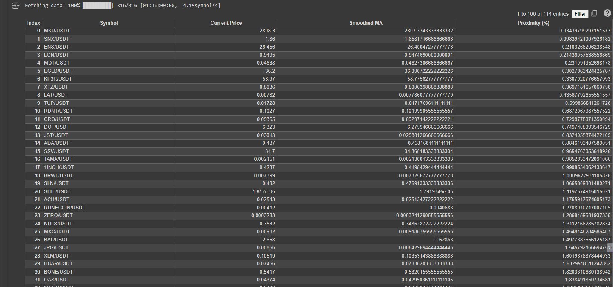

# CryptoMA200Analyzer

This project demonstrates how to use the [CCXT](https://github.com/ccxt/ccxt) library to fetch and analyze cryptocurrency data from the OKX exchange. The data is processed in Python and displayed in Google Colab.

## About

The project provides a framework for fetching historical cryptocurrency data, calculating a Moving Average (MA) with smoothing, and identifying cryptocurrency pairs where the current price is greater than and close to the smoothed MA value. This analysis focuses on pairs ending with USDT and excludes stablecoins.

## Features

- **Fetch Historical Data**: Retrieve historical OHLCV (Open, High, Low, Close, Volume) data for cryptocurrency pairs from the OKX exchange.
- **MA Calculation**: Calculate a 200-period Moving Average (MA) and apply a 9-period simple moving average (SMA) for smoothing.
- **Proximity Analysis**: Identify pairs where the current price is greater than and within 5% of the smoothed MA.
- **Progress Bar**: Display a progress bar for data fetching using the `tqdm` library.
- **Data Presentation**: Present results in a structured table using `pandas`.

## Getting Started

Follow these instructions to set up and run the project in Google Colab.

### Prerequisites

Ensure you have a Google account to access Google Colab and have an internet connection to fetch data from the exchange.

## Setup

1. **Open .ipynb in Repository**: Click on "Open Colab".
2. **Copy into your Colab**: "file" On the top, then Click on "Save a copy in Drive".

### Running the Code

- Run "Installation necessary libraries" cell.
- Run each cell in sequence "Final Version" to execute the code.
- Observe the progress bar as data is fetched from the exchange.
- The results will be displayed in a table at the end, showing symbols, current prices, smoothed MA, and proximity in percentage.

### Usage

1. **Initialize the Exchange**: Use the CCXT library to initialize the OKX exchange.
2. **Fetch Market Symbols**: Filter for USDT pairs and exclude stablecoins.
3. **Retrieve Data and Analyze**: Use the provided functions to fetch data, calculate the smoothed MA, and analyze proximity.
4. **Display Results**: Use `pandas` to present the results in a table format.

## Example Output

The output will display a DataFrame with the following columns:

- **Symbol**: The trading pair symbol (e.g., BTC/USDT).
- **Current Price**: The latest closing price.
- **Smoothed MA**: The calculated 200-period moving average, smoothed by a 9-period SMA.
- **Proximity (%)**: The relative proximity of the current price to the smoothed MA, expressed as a percentage.

## Troubleshooting

- Ensure all libraries are installed correctly using `!pip install`.
- If no data appears, verify that the API is accessible and the correct symbols are being fetched.

## Contributing

Contributions are welcome! Feel free to open issues or submit pull requests.

## Acknowledgments

- Thanks to [CCXT](https://github.com/ccxt/ccxt) for providing a comprehensive cryptocurrency exchange trading library.
- Thanks to [Google Colab](https://colab.research.google.com) for providing an easy-to-use platform for running Python code in the cloud.
